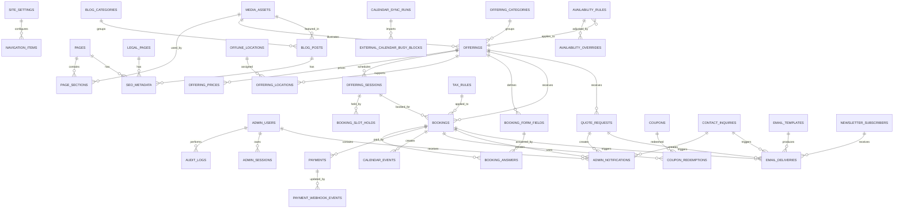

# Entity Relationship Diagram

## 1. Purpose

This document defines the canonical data model for the Ahmed Ramah Coaching Platform. It is the source of truth for database design and Drizzle schema implementation.

## 2. Modeling Principles

- PostgreSQL is the source of truth.
- Drizzle ORM owns schema and migrations.
- Public users are guests; there is no customer account table in MVP.
- Admin users are authenticated platform operators.
- Booking is the core domain.
- Payment is attached to paid bookings, not shop orders.
- CMS is full scope.
- Public presentation supports English and Arabic through additive per-resource translation tables; base business entities, prices, availability, bookings, payments, and provider records are never duplicated by locale.
- Soft delete is preferred for operational and audit-heavy records.

## 3. High-Level Domain Areas

- Identity and admin.
- CMS and media.
- Offerings and service catalog.
- Booking forms and answers.
- Availability, slots, locations, and calendar.
- Pricing, discounts, coupons, and taxes.
- Bookings and quote requests.
- Payments and webhooks.
- Contact, newsletter, notifications, and email.
- Blog.
- Audit and analytics.

## 4. Consolidated ERD

## 5. Entity Catalog

### 5.1 Identity and Administration

#### ADMIN_USERS

Authenticated dashboard users.

Key fields:

- `id`
- `name`
- `email`
- `password_hash`
- `role`
- `status`
- `last_login_at`
- `created_at`
- `updated_at`

#### ADMIN_SESSIONS

Active or historical admin sessions.

Key fields:

- `id`
- `admin_user_id`
- `session_token_hash`
- `ip_address`
- `user_agent`
- `expires_at`
- `revoked_at`
- `created_at`

#### AUDIT_LOGS

Append-only admin activity trail.

Key fields:

- `id`
- `admin_user_id`
- `action`
- `resource_type`
- `resource_id`
- `before_snapshot`
- `after_snapshot`
- `ip_address`
- `created_at`

#### ADMIN_NOTIFICATIONS

Dashboard-visible operational notifications.

Key fields:

- `id`
- `admin_user_id`
- `type`
- `title`
- `message`
- `resource_type`
- `resource_id`
- `read_at`
- `created_at`

### 5.2 CMS and Site

#### SITE_SETTINGS

Global site configuration.

Key fields:

- `id`
- `site_name`
- `default_locale`
- `contact_email`
- `contact_phone`
- `social_links`
- `booking_default_timezone`
- `created_at`
- `updated_at`

#### NAVIGATION_ITEMS

Header/footer navigation.

Key fields:

- `id`
- `label`
- `url`
- `location`
- `sort_order`
- `status`

#### PAGES

CMS-managed pages.

Key fields:

- `id`
- `slug`
- `title`
- `status`
- `template`
- `published_at`
- `created_at`
- `updated_at`

#### PAGE_SECTIONS

Flexible page sections.

Key fields:

- `id`
- `page_id`
- `section_type`
- `title`
- `body`
- `config`
- `media_asset_id`
- `sort_order`
- `status`

#### MEDIA_ASSETS

Uploaded media.

Key fields:

- `id`
- `file_name`
- `mime_type`
- `storage_key`
- `public_url`
- `alt_text`
- `size_bytes`
- `status`
- `created_at`

#### LEGAL_PAGES

Privacy policy and terms.

Key fields:

- `id`
- `slug`
- `title`
- `body`
- `version`
- `status`
- `published_at`

#### SEO_METADATA

Reusable SEO metadata for pages/posts/legal content.

Key fields:

- `id`
- `resource_type`
- `resource_id`
- `meta_title`
- `meta_description`
- `canonical_url`
- `og_image_asset_id`
- `noindex`

### 5.3 Offerings

#### OFFERING_CATEGORIES

Groups offerings.

Key fields:

- `id`
- `name`
- `slug`
- `description`
- `sort_order`
- `status`

#### OFFERINGS

Bookable or quoteable services.

Key fields:

- `id`
- `category_id`
- `title`
- `slug`
- `short_description`
- `long_description`
- `offering_type`
- `attendance_mode`
- `booking_mode`
- `duration_minutes`
- `capacity`
- `requires_payment`
- `quote_only`
- `status`
- `featured_media_asset_id`
- `created_at`
- `updated_at`

#### OFFERING_PRICES

Country and currency-specific prices.

Key fields:

- `id`
- `offering_id`
- `country_code`
- `currency`
- `base_amount_minor`
- `early_bird_amount_minor`
- `early_bird_ends_at`
- `status`

#### OFFERING_SESSIONS

Specific event/session schedule instances.

Key fields:

- `id`
- `offering_id`
- `starts_at`
- `ends_at`
- `timezone`
- `capacity`
- `attendance_mode`
- `location_id`
- `google_calendar_event_id`
- `status`

#### OFFLINE_LOCATIONS

Physical locations.

Key fields:

- `id`
- `name`
- `address_line_1`
- `address_line_2`
- `city`
- `country_code`
- `map_url`
- `instructions`
- `status`

#### OFFERING_LOCATIONS

Join table assigning locations to offerings.

Key fields:

- `id`
- `offering_id`
- `location_id`

### 5.4 Booking Forms

#### BOOKING_FORM_FIELDS

Dynamic fields per offering or type.

Key fields:

- `id`
- `offering_id`
- `field_key`
- `label`
- `field_type`
- `required`
- `options`
- `validation_rules`
- `sort_order`
- `status`

#### BOOKING_ANSWERS

Submitted answers.

Key fields:

- `id`
- `booking_id`
- `field_id`
- `field_key_snapshot`
- `label_snapshot`
- `value`

### 5.5 Availability and Calendar

#### AVAILABILITY_RULES

Recurring availability.

Key fields:

- `id`
- `offering_id`
- `weekday`
- `start_time`
- `end_time`
- `timezone`
- `slot_duration_minutes`
- `buffer_before_minutes`
- `buffer_after_minutes`
- `status`

#### AVAILABILITY_OVERRIDES

One-off availability changes.

Key fields:

- `id`
- `availability_rule_id`
- `offering_id`
- `date`
- `override_type`
- `starts_at`
- `ends_at`
- `reason`

#### BOOKING_SLOT_HOLDS

Temporary holds during booking/payment.

Key fields:

- `id`
- `offering_id`
- `offering_session_id`
- `slot_start_at`
- `slot_end_at`
- `booking_id`
- `status`
- `expires_at`
- `created_at`

#### CALENDAR_EVENTS

Calendar records created for bookings.

Key fields:

- `id`
- `booking_id`
- `provider`
- `external_event_id`
- `meet_url`
- `status`
- `last_error`
- `created_at`

#### CALENDAR_SYNC_RUNS

Sync job history.

Key fields:

- `id`
- `provider`
- `started_at`
- `finished_at`
- `status`
- `records_imported`
- `last_error`

#### EXTERNAL_CALENDAR_BUSY_BLOCKS

Imported busy times.

Key fields:

- `id`
- `provider`
- `external_event_id`
- `starts_at`
- `ends_at`
- `status`
- `synced_at`

### 5.6 Bookings and Quotes

#### BOOKINGS

Core booking record.

Key fields:

- `id`
- `public_token`
- `offering_id`
- `offering_session_id`
- `attendance_mode`
- `status`
- `customer_full_name`
- `customer_email`
- `customer_phone`
- `country_code`
- `slot_start_at`
- `slot_end_at`
- `timezone`
- `price_currency`
- `base_amount_minor`
- `discount_amount_minor`
- `tax_amount_minor`
- `total_amount_minor`
- `payment_required`
- `confirmed_at`
- `cancelled_at`
- `created_at`
- `updated_at`

#### QUOTE_REQUESTS

Corporate/custom requests.

Key fields:

- `id`
- `offering_id`
- `status`
- `full_name`
- `email`
- `phone`
- `company_name`
- `participants_count`
- `preferred_date`
- `message`
- `admin_notes`
- `created_at`
- `updated_at`

### 5.7 Pricing, Coupons, Taxes

#### COUPONS

Discount codes.

Key fields:

- `id`
- `code`
- `description`
- `discount_type`
- `discount_value`
- `starts_at`
- `ends_at`
- `usage_limit`
- `per_email_limit`
- `status`

#### COUPON_REDEMPTIONS

Coupon usage records.

Key fields:

- `id`
- `coupon_id`
- `booking_id`
- `customer_email`
- `discount_amount_minor`
- `created_at`

#### TAX_RULES

Tax configuration.

Key fields:

- `id`
- `name`
- `country_code`
- `percentage`
- `status`
- `starts_at`
- `ends_at`

### 5.8 Payments

#### PAYMENTS

Payment attempts and outcomes.

Key fields:

- `id`
- `booking_id`
- `provider`
- `provider_payment_id`
- `status`
- `currency`
- `amount_minor`
- `checkout_url`
- `idempotency_key`
- `paid_at`
- `failed_at`
- `created_at`
- `updated_at`

#### PAYMENT_WEBHOOK_EVENTS

Raw verified webhook event log.

Key fields:

- `id`
- `provider`
- `provider_event_id`
- `payment_id`
- `booking_id`
- `event_type`
- `signature_valid`
- `payload`
- `processed_at`
- `processing_status`
- `created_at`

### 5.9 Contact, Newsletter, Email

#### CONTACT_INQUIRIES

Contact form submissions.

Key fields:

- `id`
- `full_name`
- `email`
- `phone`
- `subject`
- `message`
- `status`
- `source_page`
- `created_at`

#### NEWSLETTER_SUBSCRIBERS

Newsletter records.

Key fields:

- `id`
- `email`
- `name`
- `country_code`
- `status`
- `source`
- `unsubscribe_token`
- `created_at`
- `unsubscribed_at`

#### EMAIL_TEMPLATES

Transactional templates.

Key fields:

- `id`
- `key`
- `subject`
- `body`
- `status`
- `updated_at`

#### EMAIL_DELIVERIES

Email delivery attempts.

Key fields:

- `id`
- `template_id`
- `recipient_email`
- `resource_type`
- `resource_id`
- `provider`
- `provider_message_id`
- `status`
- `last_error`
- `sent_at`
- `created_at`

### 5.10 Blog

#### BLOG_CATEGORIES

Blog categories.

Key fields:

- `id`
- `name`
- `slug`
- `status`

#### BLOG_POSTS

Published/draft articles.

Key fields:

- `id`
- `category_id`
- `title`
- `slug`
- `excerpt`
- `body`
- `featured_media_asset_id`
- `status`
- `published_at`
- `created_at`
- `updated_at`

## 6. Recommended Enums

### Content Status

- `draft`
- `published`
- `scheduled`
- `archived`

### Admin Status

- `active`
- `invited`
- `suspended`
- `disabled`

### Offering Type

- `coaching`
- `therapy_session`
- `workshop`
- `webinar`
- `course`
- `corporate_training`
- `custom`

### Attendance Mode

- `online`
- `offline`
- `hybrid`

### Booking Mode

- `free`
- `paid`
- `quote_only`

### Booking Status

- `draft`
- `pending_payment`
- `payment_failed`
- `confirmed`
- `cancelled`
- `rescheduled`
- `completed`
- `no_show`
- `expired`
- `rejected`

### Payment Status

- `created`
- `pending`
- `paid`
- `failed`
- `cancelled`
- `expired`
- `refunded`

### Quote Status

- `new`
- `reviewing`
- `contacted`
- `won`
- `lost`
- `archived`

## 7. Critical Constraints

### 7.1 Booking Conflict Prevention

The system must prevent overlapping confirmed bookings and active holds for the same offering/session/slot capacity.

### 7.2 Payment Confirmation

Bookings requiring payment can move to confirmed only from trusted backend payment verification.

### 7.3 Pricing Snapshot

Each booking must store the resolved price snapshot. Future price changes must not mutate historical booking totals.

### 7.4 Form Snapshot

Booking answers must store field key and label snapshots. Future form edits must not make old submissions unreadable.

### 7.5 Auditability

Admin changes to bookings, offerings, pricing, users, and content publication must be auditable.

## 8. Acceptance Criteria

The ERD is acceptable when it supports:

- Full CMS.
- Guest booking.
- Paid booking.
- Calendar integration.
- Country pricing.
- Early bird, coupons, taxes.
- Blog/newsletter/contact.
- Quote requests.
- Multi-admin access.
- Audit logs.
- No shop or digital download domain.
