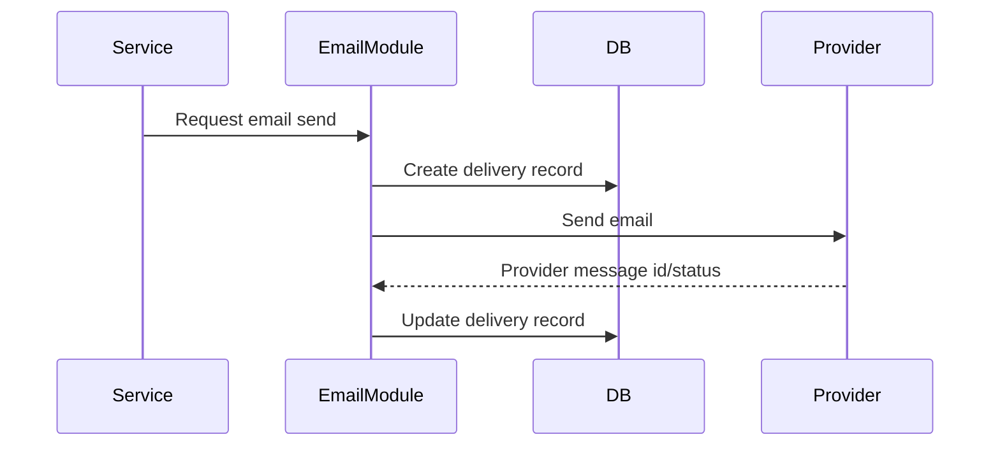

# Email and Notification Architecture

## 1. Purpose

This document defines transactional email and dashboard notification behavior.

## 2. Provider

Resend is the expected email provider based on proposal scope, but the backend should keep the email provider behind a small adapter where practical.

## 3. Notification Types

### Customer Emails

- Free booking confirmation.
- Paid booking confirmation.
- Payment pending instructions where needed.
- Payment failure notice where appropriate.
- Booking reschedule.
- Booking cancellation.
- Quote request receipt.
- Contact inquiry receipt.
- Newsletter subscription confirmation where configured.

### Admin Emails

- New booking.
- Paid booking confirmed.
- Payment failed or requires review.
- New quote request.
- New contact inquiry.
- New newsletter subscriber where configured.
- Calendar integration failure requiring attention.

### Dashboard Notifications

- New operational records.
- Payment failures.
- Calendar failures.
- Email failures.
- Quote requests needing review.

## 4. Email Flow

## 5. Template Model

Templates should support:

- Key.
- Subject.
- Body.
- Variables.
- Status.
- Last updated by admin.

Template examples:

- `booking.free.confirmed.customer`
- `booking.paid.confirmed.customer`
- `booking.new.admin`
- `quote.received.customer`
- `quote.new.admin`
- `contact.received.customer`
- `newsletter.confirmed.customer`

## 6. Delivery Logging

Each email attempt should store:

- Template key.
- Recipient.
- Resource type/id.
- Provider.
- Provider message ID.
- Status.
- Error.
- Sent timestamp.

## 7. Retry Rules

- Transient provider failures may be retried.
- Permanent validation failures should not be retried automatically.
- Retry count should be limited.
- Admin/operator should be able to see failures.

## 8. Resend Quota Awareness

The proposal notes free-tier limits such as daily and monthly quotas. The system should make email failures visible so quota-related failures are not silent.

## 9. Dashboard Notifications

Dashboard notifications should be created independently of email success. If email fails, admin dashboard notifications should still exist for core events.

## 10. Acceptance Criteria

Email architecture is acceptable when:

- Customer and admin emails are sent for core workflows.
- Delivery attempts are logged.
- Failures are visible.
- Authorized admins can manage required English/Arabic customer templates with validated placeholders, immutable published revisions, protected preview, and audited lifecycle; retries render the revision snapshotted at enqueue time.
- Email failure does not corrupt valid bookings.
